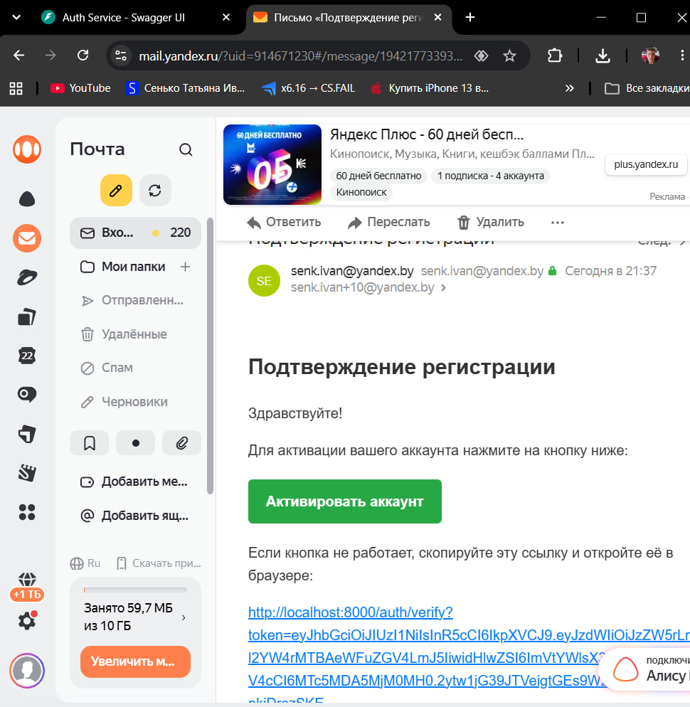
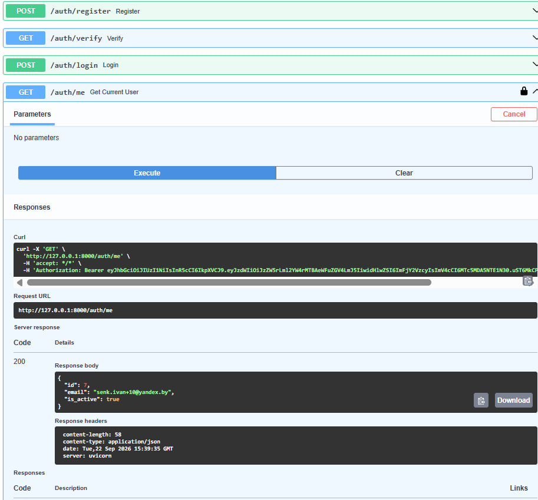

# Сервис авторизации с подтверждением по Email

Асинхронный REST API сервис авторизации и аутентификации, построенный на FastAPI и PostgreSQL.

## Стек технологий

- **Backend:** Python 3.11, FastAPI, Uvicorn
- **Основная база данных:** PostgreSQL + SQLAlchemy 2.0 (asyncio) + asyncpg
- **Тестовая база данных:** SQLite (`sqlite+aiosqlite:///:memory:`) — *используется исключительно для изолированного и мгновенного выполнения интеграционных тестов без затрагивания основной БД*
- **Безопасность:** PyJWT, Passlib (bcrypt)
- **Тестирование:** Pytest, pytest-asyncio, HTTPX
- **Контейнеризация:** Docker, Docker Compose

## Функциональность

- Регистрация пользователей с валидацией формата Email и проверкой на дубликаты
- Безопасное хэширование паролей через `bcrypt`
- Отправка реального HTML-письма с кнопкой активации на указнный Email через Yandex SMTP (SSL)
- Подтверждение аккаунта по JWT-токену с немедленной автоматической выдачей `access_token` при переходе по ссылке
- Авторизация по логину и паролю (OAuth2 Password Flow)
- Защищенный эндпоинт `/auth/me` для получения текущего профиля авторизованного пользователя

## Демонстрация работы

> **Примечание:** Все персональные данные, реальные почтовые адреса и токены на демонстрационных материалах изменены или замазаны в целях безопасности.

Пользователь получает письмо с кнопкой подтверждения прямо на свой email:



После активации доступен полноценный доступ к API (Swagger UI):



---

## Быстрый запуск через Docker Compose

1. Клонируйте репозиторий и перейдите в директорию проекта:
   ```bash
   git clone <URL>
   cd InnoTechPY/fastapi_auth
